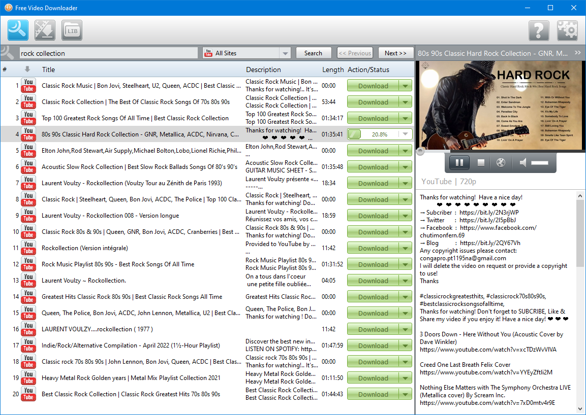
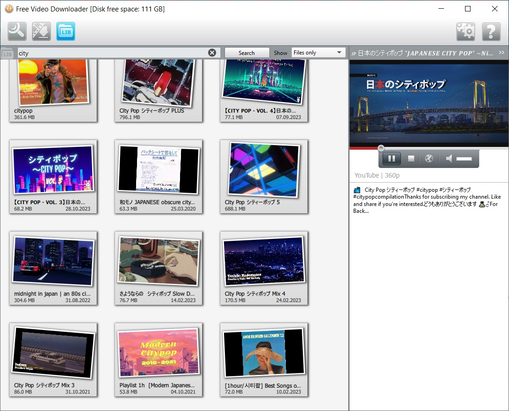

# FVD (Free Video Downloader)


Either drag-and-drop an URL from a web browser or use the built-in search:







A modern cross-platform **video downloader and media acquisition application** built with **C++ and Qt**. FVD provides a graphical interface for searching, downloading, and managing online video content while demonstrating a clean integration between native C++ code and embedded Python components.

The project can also serve as a practical example of **Qt ↔ Python interoperability** inside a desktop application.

---

## Features

- 🎬 Download online videos from supported services
- 🔍 Built-in content search
- 🖱️ Drag-and-drop URL support directly from web browsers
- 📥 Download queue management
- 🌐 Network communication through Qt Network
- 🔒 HTTPS support via OpenSSL
- 🎨 Modern Qt Quick / QML based user interface
- 🌍 Translation infrastructure
- ⚡ Cross-platform build system using CMake
- 🐍 Python-powered scripting and provider integration
- 🎞 FFmpeg integration for media processing

---

# Technical Overview

## Architecture

The application follows a modular architecture separating:

- GUI
- Download management
- Network layer
- Media processing
- Python scripting
- Common utility library

Typical high-level architecture:

```
+-------------------------+
| Qt Widgets / QML UI     |
+------------+------------+
             |
             v
+-------------------------+
| Application Controllers |
+------------+------------+
             |
      +------+------+
      |             |
      v             v
 Download      Python Engine
 Manager          |
      |           |
      |      Python Providers
      |
      v
 Network Layer
      |
      v
 FFmpeg / File Storage
```

---

# Technologies Used

## Core

- Modern C++
- CMake
- Qt 5

Qt modules include:

- QtCore
- QtGui
- QtWidgets
- QtNetwork
- QtConcurrent
- QtQuick
- QtQuickControls2
- QtQuickWidgets
- QtQml

---

## Multimedia

The project integrates **FFmpeg** for media-related functionality.

Possible responsibilities include:

- media inspection
- stream handling
- download processing
- format-related operations

---

## Security

Uses **OpenSSL** for:

- HTTPS communication
- TLS encryption
- secure network requests

---

## Python Integration

One of the most interesting technical aspects is the embedded Python subsystem.

The repository contains a dedicated scripting engine:

```
common/scriptengine/
```

This allows:

- embedding Python into the C++ application
- executing Python scripts
- extending downloader functionality
- separating provider logic from native code
- easier maintenance when providers change

This architecture makes adapting to changes in online services significantly easier than rebuilding the entire C++ application.

---

# User Interface

The application combines multiple Qt technologies:

- Qt Widgets
- Qt Quick
- QML
- Quick Controls 2

This provides:

- responsive interface
- modern controls
- native desktop integration
- hardware-accelerated rendering (optional OpenGL developer mode)

---

# Build System

The project uses an extensive **CMake** build system.

Highlights include:

- configurable project options
- platform-specific installation rules
- automatic Qt integration
- Doxygen support
- unit testing support
- translation generation
- developer build options

Developer switches include:

- OpenGL support
- traffic control functionality
- translation generation
- Lua scripting (optional)
- testing infrastructure

---

# Cross-Platform Design

The build system contains support for:

- Windows
- Linux
- macOS

Platform-specific installation paths are handled automatically.

---

# Dependency Management

Major dependencies include:

| Library | Purpose |
|----------|---------|
| Qt | GUI, networking, concurrency |
| FFmpeg | Media processing |
| OpenSSL | Secure networking |
| Python | Script execution |
| CMake | Build system |

---

# Project Organization

Typical repository layout:

```
src/
    common/
    scripting/
    ui/
    network/
    media/
    ...
cmake/
imports/
translations/
.github/
```

This organization keeps third-party libraries, reusable components, and application logic well separated.

---

# Extensibility

The project is designed for extension.

Possible additions include:

- new download providers
- additional scripting modules
- new search engines
- metadata extraction
- subtitle downloading
- playlist support
- post-processing pipelines

The scripting subsystem greatly simplifies implementation of new providers.

---

# Developer Features

The source tree includes optional developer functionality:

- Doxygen documentation generation
- unit testing support
- configurable compile-time options
- optional OpenGL rendering
- translation generation
- CI workflow for Windows
- code formatting configuration (.clang-format)

---

# CI/CD

The repository includes GitHub Actions workflows for automated Windows builds, enabling continuous integration and helping maintain build quality across changes.

---

# Design Characteristics

- Modular architecture
- Separation of GUI and backend
- Scriptable provider layer
- Native C++ performance
- Modern Qt interface
- Cross-platform portability
- Extensible CMake infrastructure
- Clean dependency organization

---

# Interesting Technical Points

- Embedded Python scripting inside a native C++ application.
- Integration of Qt Widgets and Qt Quick in the same desktop application.
- FFmpeg-based multimedia backend.
- OpenSSL-backed secure networking.
- Modular architecture suitable for adding new online providers.
- Build configuration supporting multiple optional developer features.
- Well-structured CMake project with reusable helper modules.

---

# Possible Use Cases

- Video downloading
- Educational example of Qt + Python integration
- Cross-platform desktop application development
- FFmpeg integration reference
- Native GUI application architecture
- Media utility development

---

## Summary

FVD is a modern C++/Qt desktop application demonstrating how to combine **Qt**, **FFmpeg**, **OpenSSL**, and an embedded **Python scripting engine** into a modular media downloader. Beyond its practical functionality, the project serves as a solid reference implementation for hybrid native/scripting architectures, cross-platform CMake projects, and extensible multimedia desktop applications.


```
pip3 install --force-reinstall https://github.com/yt-dlp/yt-dlp/archive/refs/heads/master.zip
```

For Fedora:
```
sudo dnf install qt5-qtquickcontrols2-devel
sudo dnf install qt5-qtbase-private-devel
sudo dnf install qt5-linguist
```

You may need to install Node.js and make its executable reachable through the PATH environment variable.
